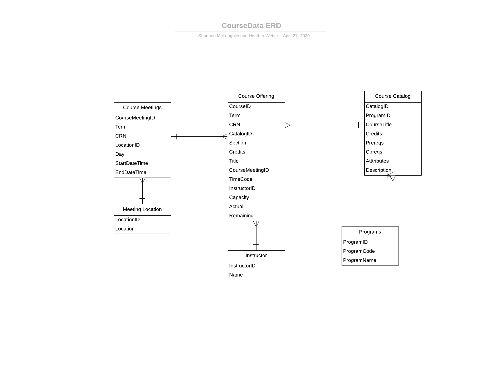
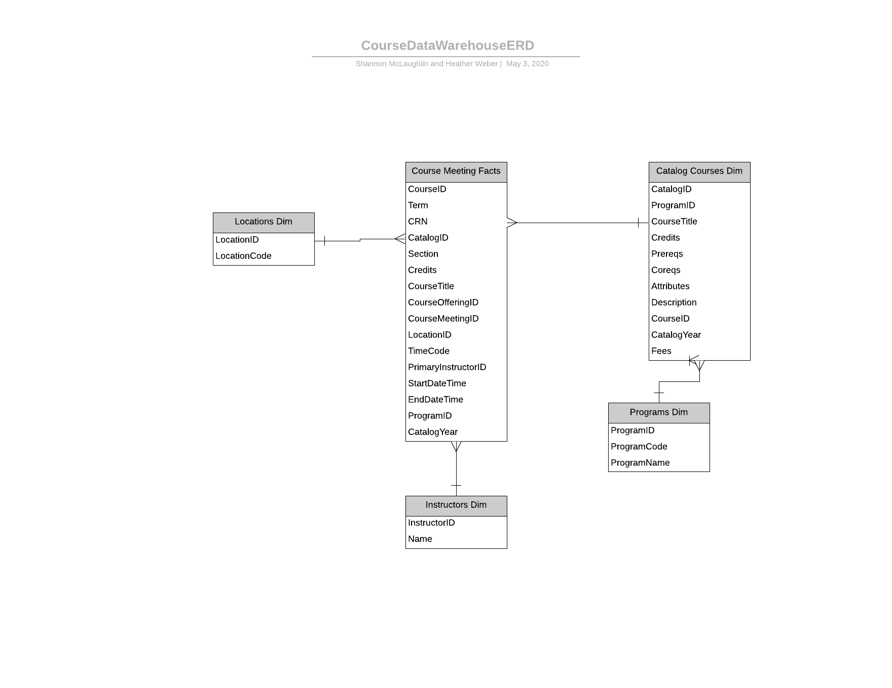

# term-project-independent
term-project-independent created by GitHub Classroom
# Independent Study
## By Shannon McLaughlin and Heather Weber

## Description
* Utilized knowledge of sql and python (from previous course offerings) to design a datawarehouse in order to answer analytical question regarding the banner registration system
* Viewed Fairfield U Banner System 

## Assessed Source Data
* Used the source data folder to assess the subfolders: academic calendars and catalogs
* Used data to understand course offerings listed on Banner
* Created ERD based on the Banner System --> This helps us normalize our data 

## Created a SQLite Database -- "CourseData.db"
* Imported csv file into database
* Created tables to reflect the ERD 
* Loaded the data from the source data csv files into the ERD tables 
[CourseDataETL](https://github.com/fairfield-ba510-spring2020/term-project-independent/blob/master/CourseDataETL.ipynb)

## Testing Database Integrity
* Tested databases to ensure domain, entity and relational integrity 
* [CourseDataTests](https://github.com/fairfield-ba510-spring2020/term-project-independent/blob/master/CourseDataTests.ipynb)

## Designed and Built DataWarehouse -- "CourseDataWarehouse.db"
* Used Star Schema design including dimension tables and fact tables relating to the source data
* Created ERD to represent star schema 

* Extracted data from CourseData into CourseDataWarehouse 
* Used roll up queries to load data to tables 
* [CourseDataWarehouse](https://github.com/fairfield-ba510-spring2020/term-project-independent/blob/master/CourseDataWarehouse.ipynb)

## Test DataWarehouse Integrity
* Tested datawarehouse to ensure domain, entity and relational integrity
* [DataWarehouse Tests](https://github.com/fairfield-ba510-spring2020/term-project-independent/blob/master/CourseDatawarehouseTests.ipynb)

## Created Useful Queries to Answer Questions
1. What courses require a prereq
2. What courses does Dr. Scheraga teach?
3. What were the course offerings in Fall 2014?
4. How many courses were offered over the 2017 Winter Intersession? 
5. What courses are 4 credits?
6. What professions teach more than one course? 
* [Datawarehouse Questions](https://github.com/fairfield-ba510-spring2020/term-project-independent/blob/master/CourseDatawarehouseDemo.ipynb)

## Thank You for a Great Semester!
